JavaScript学习总结-By Yexk
==========================

Array数组对象
-------------

>   创建数组语法：

>   var arr = new Array();//定义空数组；

>   var arr = new Array(size);//定义size个数的数组；

>   var arr = [element1,element2,…]//直接定义数组；

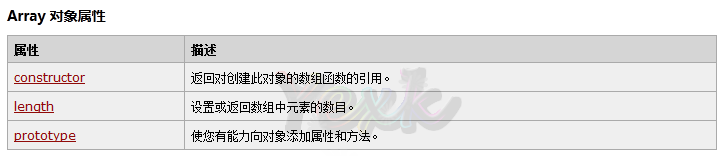

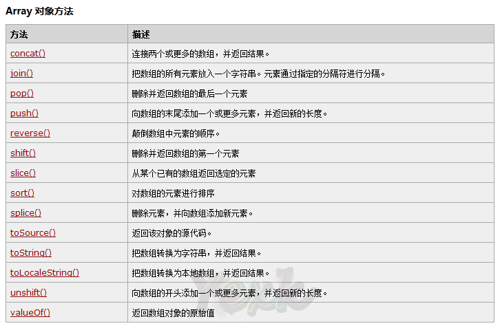

#### Array对象属性：

>   **Length**属性：

>   **语法：**arrObj.length;

>   **说明：**返回数组长度。数组的个数。

>   **实例：**

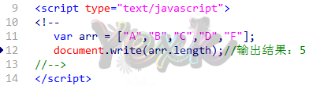

#### Array对象方法：

1.  **concat():用于连接两个或多个数组**

>   **语法：**arrObj.concat(arr1,arr2,..,arrX);

>   **说明：**返回一个新的数组。

1.  **join():把数组变成字符串**

>   **语法：arrObj.join(separator);**

>   **说明：**返回一个字符串，把arrObj的每个元素通过指定的字符(separator)进行分隔转成字符串。

| 参数      | 描述                                                             |
|-----------|------------------------------------------------------------------|
| separator | 可选。指定要使用的分隔符。如果省略该参数，则使用逗号作为分隔符。 |

>   **实例：**

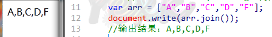

1.  **reverse():翻转数组**

>   **语法：arrObj.reverse();**

>   **说明：**该方法会改变原来的数组，而不会创建新的数组。

>   **实例：**

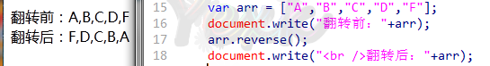

1.  **pop():删除并返回数组的最后一个元素**

>   **语法：arrObj.pop();**

>   **说明：**删除ArrObj的最后一个元素，并把数组的长度减1，并返回他删除的元素的值。如果数组已经删除完了，pop方法将不再删除，并返回undefined值。

>   **实例：**

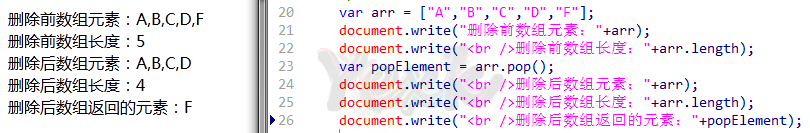

1.  **shift():删除并返回数组的第一个元素**

>   **语法：arrObj.shift();**

>   **说明：**删除ArrObj的第一个元素，并把数组的长度减1，并返回他删除的元素的值。如果数组已经删除完了，pop方法将不再删除，并返回undefined值。

>   **实例：**

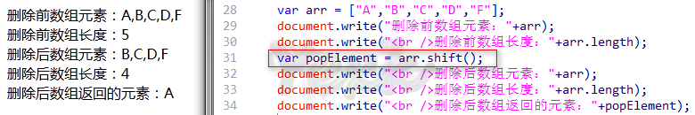

1.  **sort()：数组进行指定排序**

>   **语法：arrObj.sort(sortby);**

>   **说明：**此方法操作的是原数组。对数组按规定顺序进行排序。一般不带参数默认就是按照字母表顺序进行排序。

| 参数     | 描述                             |
|----------|----------------------------------|
| *sortby* | 可选。规定排序顺序。必须是函数。 |

>   **实例：**//此处我没有带参数，所以是默认按照字母表顺序排序

>   代码：

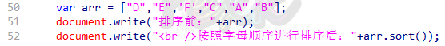

>   结果：

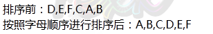

1.  **slice()：返回不删除指定一段的数组元素**

>   **语法：arrObj.slice(start,end);**

>   **说明：**返回一个新的数组，包含从 start 到 end （不包括该元素）的 arrObj
>   中的元素。请注意，该方法并不会修改数组，而是返回一个子数组。如果想删除数组中的一段元素，应该使用方法
>   ArrObj.splice()。

| 参数  | 描述                                                                                                                                                                                            |
|-------|-------------------------------------------------------------------------------------------------------------------------------------------------------------------------------------------------|
| start | 必需。规定从何处开始选取。如果是负数，那么它规定从数组尾部开始算起的位置。 也就是说，-1 指最后一个元素，-2 指倒数第二个元素，以此类推。                                                         |
| end   | 可选。规定从何处结束选取。该参数是数组片断结束处的数组下标。 如果没有指定该参数，那么切分的数组包含从 start 到数组结束的所有元素。 如果这个参数是负数，那么它规定的是从数组尾部开始算起的元素。 |

>   **实例：**

>   代码：

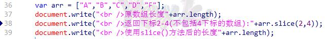

>   结果：

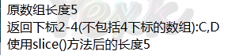

1.  **splice()：返回并删除指定一段的数组元素**

>   **语法：arrObj.splice(index,howmany,item1,.....,itemX);**

>   **说明：**与slice()的区别：splice()
>   方法会直接对数组进行修改。而slice()方法不会修改数组。

| 参数              | 描述                                                                  |
|-------------------|-----------------------------------------------------------------------|
| index             | 必需。整数，规定添加/删除项目的位置，使用负数可从数组结尾处规定位置。 |
| howmany           | 必需。要删除的项目数量。如果设置为 0，则不会删除项目。                |
| item1, ..., itemX | 可选。向数组添加的新项目。                                            |

>   **实例：**

>   代码：

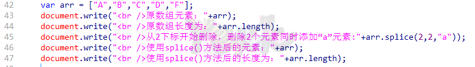

>   结果：

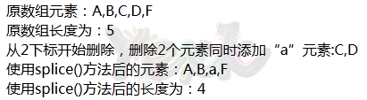

Date时间对象
------------

>   Date对象用于处理日期和时间。创建一个对象就相当于获取到了系统时间所有的信息。

>   **语法：**

>   **var myDate = new Date();**//创建当前时间；

>   **var myDate = new Date(year,month,day,hours,minutes,seconds);**

>   //用来创建其他时间，如：出生日期。

>   **代码：**

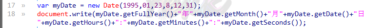

>   **结果：**

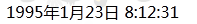

#### Date对象方法：

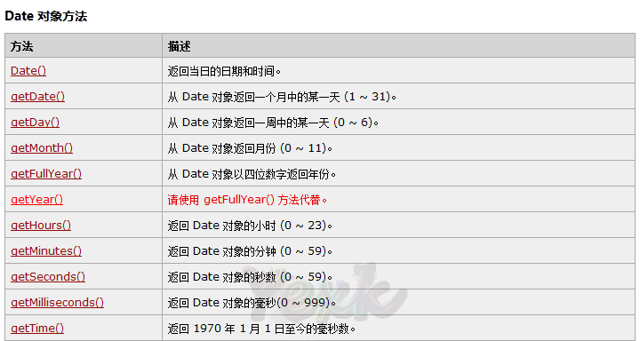

>   **实例：计算我的年龄**

>   **代码：**

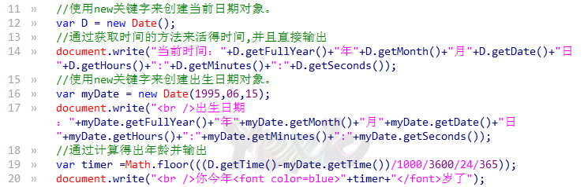

>   **结果：**

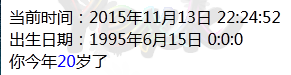

Math数学对象
------------

>   Math 对象用于执行数学任务。

>   注意：Math对象和其他的对象不同，Math对象不需要使用new关键字来创建对象。可以直接使用。如：var
>   pi_value=Math.PI;

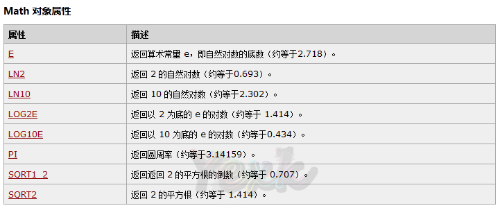

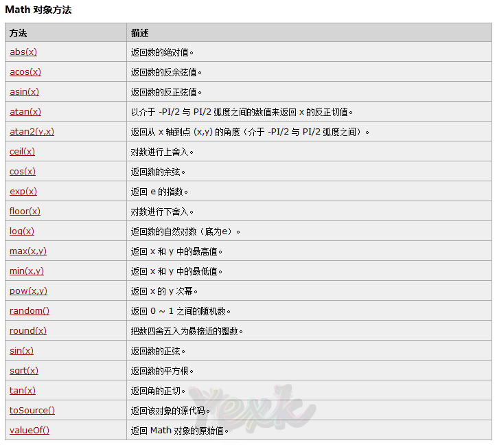

#### Math对象的方法

-   abs():对数字进行去绝对值

>   **定义：**abs()方法返回数字的绝对值

>   **语法：Math.abs(x);**

| 参数 | 描述                   |
|------|------------------------|
| x    | 必需。必须是一个数值。 |

-   ceil(x):对数进行上舍入

>   **语法**：Math.ceil(x);

>   **说明**：不管你小数点后面是什么数都进1。

>   **实例**：

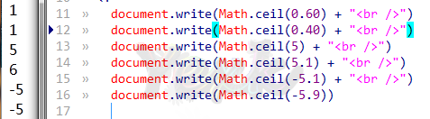

-   floor(x):对数进行下舍入

>   **语法**：Math.floor(x);

>   **说明**：不管你小数点后面是什么数都舍去。

>   **实例**：

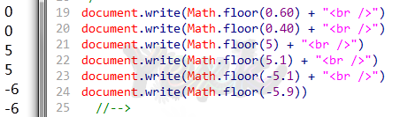

-   pow(x,y):返回x的y次幂

>   **语法**：Math.pow(x,y);

>   **说明**：计算返回x的y次幂。

>   如果结果是虚数或负数，则该方法将返回
>   NaN。如果由于指数过大而引起浮点溢出，则该方法将返回 Infinity。

| 参数 | 描述                     |
|------|--------------------------|
| x    | 必需。底数。必须是数字。 |
| y    | 必需。幂数。必须是数字。 |

>   **实例**：

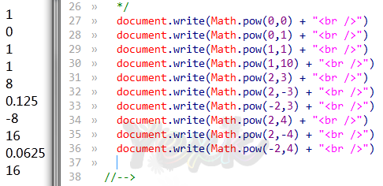

-   random():返回0\~1的随机数

>   **语法：Math.random();**

>   **说明：**返回0 \~ 1 之间的一个随机数。当然也可以求得10-19的随机值。

-   round():对数四舍五入

>   **语法：Math.round(x);**

>   **说明：**对数进行四舍五入。

>   **实例：**

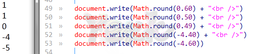

Number数字对象
--------------

>   number对象定义数值型变量时就创建了。所以无需再次创建。

#### Number对象的方法

-   toFixed(num):对数字进行保留num位小数。

**语法：NumberObject.toFixed(num)；**

**说明：**Number 四舍五入为指定小数位数的数字。

| 参数 | 描述                                                                                                                     |
|------|--------------------------------------------------------------------------------------------------------------------------|
| num  | 必需。规定小数的位数，是 0 \~ 20 之间的值，包括 0 和 20，有些实现可以支持更大的数值范围。如果省略了该参数，将用 0 代替。 |

**实例：**

代码：

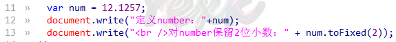

结果：

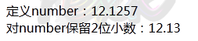

String字符串对象
----------------

>   String对象用于处理文本（字符串）；

>   创建string对象的**语法：** //一般创建字符串变量的同时就创建了字符串对象。

>   **var str = new String();**

>   **var str = “s”;**

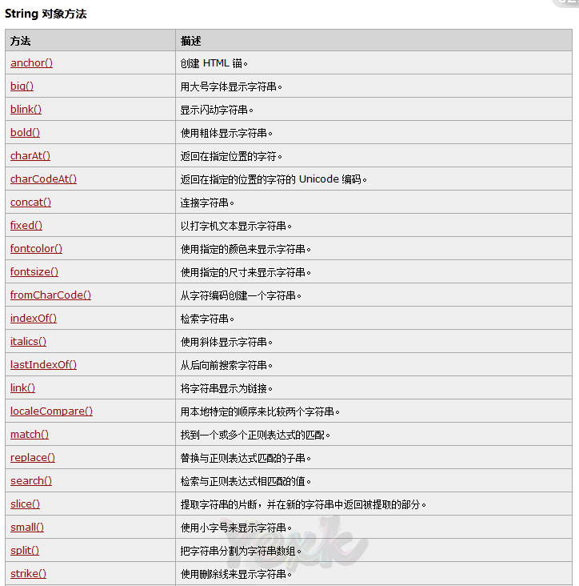

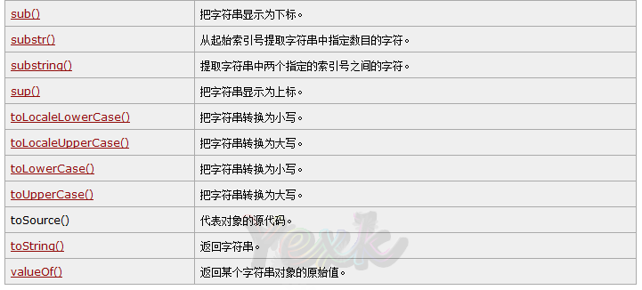

1.  **String对象的属性：**

>   **length属性：**返回字符串长度。

1.  **String对象的方法：**

    1.  **concat():**连接字符串。

    2.  **charAt():**根据下标查找字符串并返回。

    3.  **indexOf():**根据字符串查找下标并返回。（从前面开始查找）

    4.  **lastIndexOf():**根据字符串查找下标并返回。（从后面开始查找）

    5.  **link():**将字符串显示成链接。

    6.  **substr():**根据下标提取字符串。

    7.  **substring():**定义一段长度进行提取字符串。

    8.  **toLowerCase():**将字符串转成小写。（仅对字母有效）

    9.  **toUpperCase():**将字符串转成大写。（仅对字母有效）

其他
----

#### 正则表达式

[0-9]：表示匹配0-9

[a-z]：表示匹配a-z

>   [A-Z]：表示匹配A-Z

>   [a-zA-z0-9]：表示匹配所有的字母和数字

>   \-----

n\*：出现0次或以上

n+: 出现次数一次或以上

n?：出现0次或者一次

\-----

\|:或指明两项之间选择一个

.点:匹配除了\\n之外的任何单字符

\\:转义字符（去除特殊意思）

\-----

\^:表示字符串开始的位置

\$:匹配输入字符串的结束位置

\-----

():一个表达式的开始和结束

\-----

\\d:表示数字[0-9]

\\D:表示非数字[\^0-9]

\\w:字母数字下划线其中一个[a-zA-Z0-9_]

\\W:非字母

\\s:表示 空格

\\S：非空格
